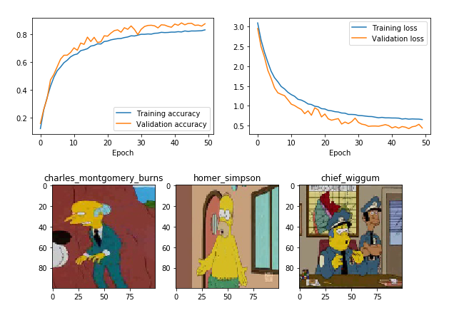

# Simpsons-character-CNN-classifier

Classify ‘The Simpsons’ characters screenshots using a convolutional neural net in Keras. Model achieves 87% accuracy on validation set.

Images obtained from: https://www.kaggle.com/alexattia/the-simpsons-characters-dataset

